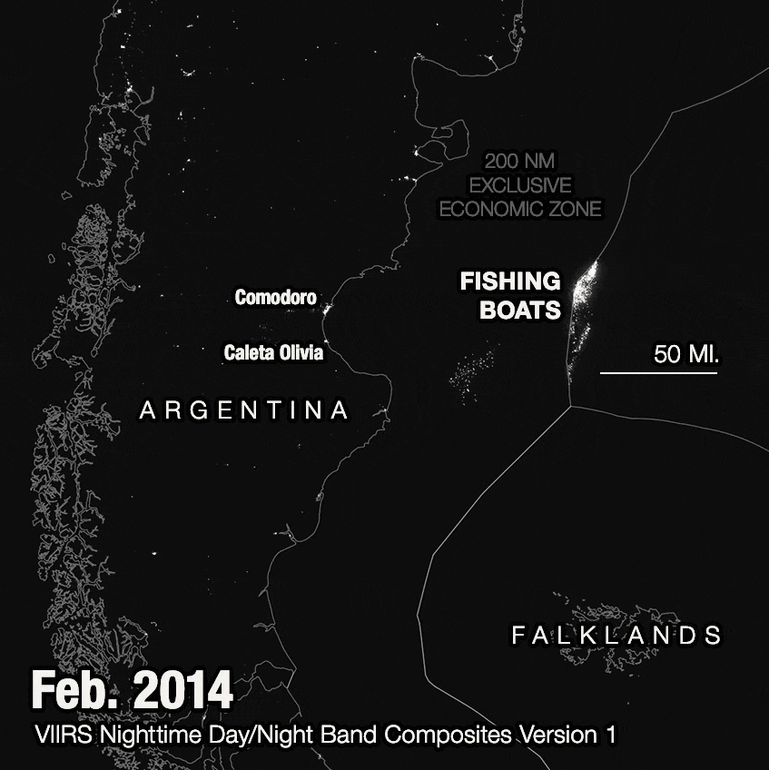

# Sixteen Square Inches of Map: a Cartography Course by Evan Applegate
_A practical course by Evan Applegate for those who want to use the computer to make nice maps. If you need help, reach out at TK._

- [Read me first](#read-me-first)
- Software
    - Install QGIS
	- Install GDAL
    - Design software
    - Eduard
	- Avenza MAPublisher
- The computer talks to the computer: LLMs and you
	- Command-line stuff, why its good and fast
- Getting map data
	- Data sources
- Processing your data
- Designing the map
	- Three rules for good maps
		- Always steal
		- Always grid
		- Always walk
	- Download the sample data package
	- Gestalt
	- Color
	- Type
		- Labels
		- Other type
	- The Territory
		- Terrain
		- Land cover
		- Contours
	- Lines
	- Fills
	- Points
- Resources

| Map Component | What You Need | Where to Get It |
|:--------------|:-------------|:----------------|
| Base Geography | Vector data (roads, boundaries, water) | OpenStreetMap, Natural Earth Data |
| Terrain | Digital Elevation Models (DEM) | USGS National Map |
| Place Names | Gazetteer data | GNIS (Geographic Names Information System) |
| Land Cover | Raster data | National Land Cover Database (NLCD) |
| Reference Style | Design templates | NPS Maps, USGS Topo |

USE THE COMPUTER TO BECOME HUMAN
* LLMs spares you massive amounts of computer-mediated time
	* Using the computer to make maps sucks. I don't speak computer; I speak english. Every bit of .js, .py, .css, .html I needed to type into the computer, I hated typing
	* You can use LLMs like OpenAI's ChatGPT, Anthropic's Claude etc to translate your wishes into "code," feed the errors back, and in minutes get a working rickety script, program, command, etc. It works at every scale of computer-work that doesn't involve people. 
		* It's the simplest possible interface: you wrote a few sentences of compressed info, it gives you code, you paste it into a text editor (Or use an IDE like Cursor, Copilot, Windsurf to do it in-line), run your code, copy/paste the error log back to the LLM, repeat 'til it works. That's it.
	* Fellow cartographers: learn to speak computer or the computer will start speaking for you. Don't be run over by the computer.

* Step-by-step
	* 1. Rent some LLM time or run on your metal
		* I like Codeium's Windsurf, you can use the Cascade feature with GPT 4o or Claude 3.5  Sonnet https://codeium.com/
	* 2. Ask it to stick together 5 terabyte datasets, run through thousands of files, do anything your data-heart can imagine. You now have a beginner-intermediate programmer friend with infinite patience. 
	* 3. Use the "model" to run "agentically " with https://github.com/cline/cline or COTS it with the Windsurf IDE Cascade feature.
	* 4. 

* Introduction: why make maps, who this guide is for (designer or illustrator) 
	* Read me first 
		* You comfortable fighting with the computer and typing into something called an "Integrated Development Environment?" You want to make beautiful maps? You tolerate lots of trials? You have any graphic design/illustration talent? What follows: download links and meta-download instructions plus idiosyncratic user notes on how n = 1 computer cartographer makes his 51st percentile maps.
	* Computer setup
		* I use OSX, but this stuff works on windows. Past the initial setup you'll see OSX stuff only.
	* Installing software
		* QGIS
		* Design software
			* Inkscape/Illustrator
				* All commands are in Illustrator but Inkscape works about the same way
			* GIMP/Photoshop
				* Same for Photoshop
		* Other sofware 
			* Eduard
				* great for making hillshades + has a great 20m global DEM grabber
			* MAPublisher
				* costs 2800 but if you make a lot of maps professionally might be useful to you. wont be covered in this course
    * Command-line stuff, why its good and fast (this ones a maybe)
		* GDAL/OGR: I install this via miniconda, much easier to keep it updated
			* Windows GDAL
			* Mac GDAL
* 1. Map data
    * 1.x Projections 101 (very basics (since i dont know much beyond that)
    	* basic 3D > 2D geometry, sacrificing one: angles, distances, relative direction, size
    		* https://ihatecoordinatesystems.com/
    	* What you have to remember: you gotta get all your data into the same coordinate reference system (CRS). Rasters, vectors, all of it. 
    * Scale
    	* what are you trying to show?
    	* Large-scale: zoomed-in, smaller denominator
    	* Small-scale: zoomed-out, larger denominator
	* 1.x Gather raster data, diff between vector and raster
		* 1.x.x Harvesting from ESRI stuff
			* ESRI's got a dozen nouns for "pipe out of which vector and raster geodata exits," there's Feature Services, Feature Layers, Map Services, Tile Services, Image Services, Scene Services, Geoprocessing Services, Network Services, Web Map Services, Web Feature Services, Web Map Tile Service, Web Coverage Service, Hosted Layers, Stream Services, Locator Services, Data Stores.
		* 1.x.x Elevation data: collected by lidar/radar, basic concept
			* USGS sources
			* OpenTopography
			* viewfinder panoramas
			* Eduard
			* Undersea data
				* GEBCO
				* NOAA topobathy
		* 1.x.x Land cover data (link to sources, general method)
			* GLOBCOVER
			* NLCD
				can load this into QGIS as a WMS
			* that chinese dataset?
		* 1.x.x Satellite data: radiometers that can make images that look like they were collected by your DSLR CCD
			* Bands, indices
			* ESA sentinel explorer
			* USGS methods
			* QGIS method
	* 1.3 Gather vector data
		* 1.x.x Toponymy (GNIS, gazzetteer, etc)
			Easiest way to get stuff for the US: https://edits.nationalmap.gov/apps/gaz-domestic/public/search/names , tick visible in current extent, query, click download>arrow

			theres an API but i dunno how to use it

			mapping outside the US but want to know what shits called?
			can spatial-query + export with https://geonames.nga.mil/geonames/GeographicNamesSearch/ , desig_cd is the type of feature, lookup table is 

			layer > add layer > add delimited text layer > ... enxt to filename, pick your CSV > under geometry definitions, select point coordinates >leave geometry CRS at 4326

			too many? research tools > select by location > first box is the GNIS point layer youre gonna cut donw, second box is the bounding box you made in the beginning > run, it'll select all the points > right click the GNIS point layer > export > save features as > tick save only selected features > change CRS to EPsG:26943 > format: ESRI shapefile (this doesnt really matter, geojson is just kinda slow for me)

			it'll give you all these categoreis, you dont need all of these on one map generally; making a physical geog map? keep the channels, points, bays, islands etc, ditch civil, military, etc

			census you can safely ditch

			Area
			Bar
			Basin
			Bay
			Beach
			Canal
			Cape
			Census
			Channel
			Civil
			Cliff
			Crossing
			Falls
			Flat
			Gap
			Gut
			Island
			Lake
			Military
			Pillar
			Populated Place
			Range
			Reservoir
			Ridge
			Sea
			Spring
			Stream
			Summit
			Swamp
			Valley
			Woods

			vector > data management tools > split vector layer > input layer is your GNIS points layer > uniqe ID field pick  "class" > output file type geojson > output directory, pick a folder to store them > run, bunch of layers appear

			pick one of your new layers > symbology > size down the points to 0.25
			labels > single labels > value set to feature name 
			rendering > text, 2 point type (this makes them easier to thin out in AI) > rendering > overlapping labels > allow overlaps without penalty
			

			styles > copy style > all style categories

			no composition in qgis, you do all that in AI
			new print layout > icon with + and a roll of paper, drag rect to canvas to add > item properties to change scale, final size > save as SVG > export layers as SVG groups > export text as text objects 

			open in AI, you gotta get the point markers in the same layer as the labels (they're separate in the SVG)

			in the AI you can replace the placeholder raw relief with your land cover + relief, i exported a PNG

			* Undersea toponymy
				https://www.charts.noaa.gov/InteractiveCatalog/nrnc.shtml for US undersea stuff
				https://www.ngdc.noaa.gov/gazetteer/ Undersea Features Gazzetter

				https://www.ngdc.noaa.gov/mgg/bathymetry/maps/directdownload.html for older NOAA undersea charts, useful for labeling

		* 1.x.x Hydro (NHD, natural earth, census, FWS, OSM)
		https://www.census.gov/geographies/mapping-files/time-series/geo/tiger-line-file.html

		water > linear hydrography > pick state > pick counties > add SHPs to QGIS

		across two counties: download both, drag SHPs into QGIS > vector > data mgmt tools > merge vector layes > pick both > have the new layer in layers patlette

		vector > geoprocessing tools > clip > pick your all_area_water layer in first dropdown, your original extent polygon in the second > run

		right slick > export > save features as... > pick name, geojson, make sure the projection is same as the project EPSG:26943

		now you have all linear hydrography (creeks, rivers) on one layer clipped to your map extent

		repeat same steps for area hydrography (lakes, ponds)

		merge all rivers, lakes of same same: vector > geoprocessing tools > dissolve > pick input layer what you want to work on > dissolve field is FULLNAME, 322 features to 89.

		repeat same for area hydrography

		coastline: https://www.census.gov/geographies/mapping-files/time-series/geo/tiger-line-file.html

		download national file
		drag SHP into QGIS
		vector > geoprocessing tools > clip > pick your all_area_water layer in first dropdown, your original extent polygon in the second > run

		vector > geoprocessing tools > dissolve > pick input layer what you want to work on > dont pick dissolve fields, this merged everything into one line

		* 1.x.x Political bounds (natural earth)
		* 1.x.x Roads, rails (OSM, census)
		Roads: https://www.census.gov/geographies/mapping-files/time-series/geo/tiger-line-file.html
		web interface

		download all roads > pick state > pick county

		across two counties: download both, drag SHPs into QGIS > vector > data mgmt tools > merge vector layes > pick both > have the new layer in layers patlette

		vector > geoprocessing tools > clip > pick your all_roads layer in first dropdown, your original extent polygon in the second > run

		right click > save as geojson > right click > open attribute table > see RTTYP? here's the lookup

		C	County
		I	Interstate
		M	Common Name
		O	Other
		S	State recognized
		U	U.S.

		I, S, U are the larger roads, usually
		C is two-lane highways
		M, and Null (no RTTYP) are smaller

		vector > data management > split vector layer > unique ID field RTTYP > output file type geojson > pick an output directory > run 

		now you have all roads on discrete layers

			* 1.3.4 Airport points, polys (OSM)
		* 1.3.5 Neighborhoods (gazzetteer? airbnb zillow?)
		* 1.3.6 Nature (OSM, parks, etc)
		* 1.3.7 Admin divs (US only)
	* 1.4 Processing your data
		* 1.4.1 Remember to reproject!
			* Raster in QGIS, GDAL
			* Vector in QGIS, GDAL
		* 1.4.2 Filtering
		Make a jig: QGIS create layer > new shapefile layer > pick a folder, name > geometry type point > it appears in the layer panel, > edit button > add point feature > click center of what you wanna map > click edit button agian to save > processing toolbox " rectangles, ovals, diamonds" > input layer = the shp you just made > shape "rectangle" > pick height, i did 50x50 mi TK > segments 4 > run > appears on layers panel > right click export > save features as... > pick a file name>  make sure CRS matches bottom right of your QGIS window, the project CRS
		right click > layer properties > information > Information from provider > Extent > copy those four values, chop off last digits

		1846577.07,502154.17 : 1904513.46,560090.55

		rearrange to ???

		head to https://coast.noaa.gov/dataviewer/#/lidar/search/-13618597.819984838,4374679.235509932,-13544447.333741099,4451287.649944467 to get an MTY topobathy DEM

		pick  NOAA NCEI Continuously Updated Digital Elevation Model (CUDEM) - Ninth Arc-Second Resolution Bathymetric-Topographic Tiles https://noaa-nos-coastal-lidar-pds.s3.amazonaws.com/dem/NCEI_ninth_Topobathy_2014_8483/index.html

		download tile index Tile Index: tileindex_NCEI_ninth_Topobathy_2014.zip

		open > shp into QGIS window > select features by area (make sure the new layer is selected on the left) > drag box around the tiles tht overlap your square > right click on tiles layer > open attribute table > bottom left  "show selected features"

		right click tile index layer > export features > pick CSV > tick "save only selected featueres" > open CSV > copy list of URLS > paste in a plain text file > download each one by one or wget -i your_file_list.txt

		drag all .TIFs into their own dir 

		`gdalbuildvrt DEM_huge.vrt *.tif` 

		drag this into window > dlb clickl to open layer properties > see pixel size = 3, -3, so its 3m pixels, ~10ft res topobathy DEM. thats a little big for the map we're making

		resize, resample, crop and reproject that big DEM:

		`gdalwarp -co "COMPRESS=LZW" -tr 10 10 -r cubic -t_srs EPSG:26943 -cutline 36_mile_square.shp -crop_to_cutline out.vrt cropped_10m.tif
`

		drag this into window > dlb clickl to open layer properties > see pixel size = 3, -3, so its 3m pixels, ~10ft res topobathy DEM. thats a little big for the map we're making

		if oyu're dumping these into EDUARD you can use whatever size you want since you can interactively generalize

		processing > terrain shading to make your outputs, test a bunch with
		ambient occlusion
		hillshade
		shadow depth
		texture shading

		when its time to go to photoshop we gotta take these from 32 bit to 8 bit to make them easier to manp in PS; theyre not RAWS you dont need all the range

		 right click > export > save as > tick "rendered image"

		Or use bbox.io?
			* Raster
				* Cropping
				* Bit depth and re-scaling DNs
				* Relief design
					* Eduard
					* QGIS
						* Terrain Shading Plugin
							* Hillshade
							* TPI
							* Texture shade
							* Shadow depth
					* GDAL
						* Different flags
					* Blender
						* Link out, I hate this thing
			* Vector
				* Spatial queries
				* Attribute-table queries
				* Contours
				check DEM units
				-i is the interval; so -i 20 on a meter-unit DEM means your contours will have 20m intervals
					gdal_contour -a ELEV -i 40 -f "ESRI Shapefile" in1.tif "out_1"

				I recommend using this script by Henrik https://hkartor.se/anteckningar/contour_lines_script.html
				I modded it to change the -ot to Float32 so I can use it for underwater bathy
				
				if you want contour polygons stedda lines use `-p -amin "min_elev" -amax "max_elev"` stedda `-a ELEV`

				to label contours
				https://opensourceoptions.com/how-to-create-contour-lines-and-labels-with-qgis/
				only thing id add: placement > general settings > mode: curved
				note: this breaks up your text paths. QGIS SVG export doesnt understand type on a path

* 2. Map Design
	* Naked theft: NPS etc
		* Choose a state, choose a park, get an Illustrator version of that map: https://www.nps.gov/carto/app/#!/parks
		* Metadata: https://www.nps.gov/carto/app/#!/maps/production-tips
		* .AIT templates towards the top, broken links but if you paste them into the archive.org waybackmachine they download fine: https://www.nps.gov/carto/app/#!/maps/starter-maps , e.g. https://web.archive.org/web/20170605123357/https://www.nps.gov/hfc/carto/starter-maps/a_starter.zip
* 2.1 Setup
		* Layers
		* Do as much as possible in QGIS to reduce one-way trips
			* create extent line that's always on your exports
		* Gestalt first!
			* lookit stuff liek this first
* X.1 Vector
		* X.1 Color
			* Steal from better maps
		* X.1 Type
		Arranging type is the most labor-intensive part of cartography. A good map has no collisions, no ambiguous placement, not one careless label. It's the brown M&M test of mapmaking: if the maker didn't look over every square inch, it'll show in the labels.
			* Examples
			Mike Hall, Daniel Huffman, Michelle Snyder, Marty Schnure, Jeff Clark, Dave Imus, Carl Churchill, Alex McPhee 

			* Halos
			Labeling tip from Andy Woodruff: instead of using outer glow/drop shadow/blurred strokes to set labels off from the background, use a blurred version of your raster underlayer that shines through 0% opacity strokes to a blurred version of your raster.

			1) "Burn" your rivers, roads into your raster, You can do this in Illustrator by exporting a no-labels PNG of the whole map, artboard = full extent.
			2) Create a blurred version of this raster: I like turning it into a Photoshop smart object before gaussian-blurring so I can adjust it later. 
			3) Layer order top-to-bottom: all map stuff (including your raster underlayer) in one supra-layer > blurred raster
			4) Check knockout group on your supra-layer
			5) For your label layer: add a 0% opacity blurred stroke, drag it under "contents" to ensure your original type colors are preserved
			6) Enjoy your sweet movable type halos

			* Knockouts
				https://somethingaboutmaps.wordpress.com/2021/05/19/blurring-backgrounds-to-improve-text-legibility/
				https://somethingaboutmaps.wordpress.com/2015/05/08/type-knockouts-in-illustrator/
				https://somethingaboutmaps.wordpress.com/2016/12/05/even-fancier-type-knockouts-in-illustrator/
				https://somethingaboutmaps.wordpress.com/2018/10/28/smart-type-halos-in-photoshop-and-illustrator/
			* How to label...
				* Rivers, Ranges, Areas
					type on a path is annoying but no way to improve at this without getting your reps in. Use direct select tool (A, looks like a white arrow) to drag the handles from either end, if your text flips upside down drag ⟘ perpendicular to your line, if you can't see anything but a red + you gotta drag the handles from either end. Add points to the line with pen tool add anchor point, drag out sides, then use direct select to select new anchor point, drag bezier handles to get the text lookin right.

					You gotta track this out; a long mountain range or river gets type that looks like t    h    i     s  and a short one gets text that looks like this. 
				* Points
					top right?
				* Road shields
					steal from noun project
				* Soundings
					itals
				* Contours
					dunno how to do this automated
		* X.1 Icons
			* Symbol palette
			Use Nate Kelso's replace-with-symbol to get QGIS's lil point symbols into symbols; create symbol you like, select it + the points you want to turn into that symbol, run this 
			https://kelsocartography.com/scripts/scripts/nvkelso/findAndReplaceGraphic_centered_v2.jsx
		* X.1 Lines
			* Casing roads
			* Dotted, dashed lines
		* X.1 Polygons/shapes/fills
			* Glows
			Polygons with interior faded glows: black fill, feather effect, opacity 0% above ANOTHER fill with the color you like. might need knockout group enabled too
			* Coast lines (adjustment panel)
			Making vintage-style coast lines in Illustrator: to your coastline path add a series of strokes in the appearance panel, each gets an offset path effect. Increase the offset path distance between each stroke so they spread out as they get further from the coast.

			This is a last step as it makes Illustrator very slow; I save the appearance as a graphic style and apply it when I'm ready to export.

			* Generalization
				Cut down voids/gaps in your parks layers manually, makes a cleaner output. mapshaper.org is good for this too if you jstu want fewer vertices
		* Metadata
			in QGIS print composer on the left is "add scale bar," drag a box and it'll appear, i change it to miles and add some segments. you'll use this as a template to draw over in illustrator
* X.1 Raster
		* Blend modes, opacity
		* Adjustment layers
		* Land cover
		NLCD WMTS layer > cropped TIF > PS > re-paste into discrete classes > change colors, add patterns from my old LC.psb > steal colors from henrik, churchill, old USGS > use end-at-land topobathy DEM to mask land and add topobathy gradient

		NLCD to vector:
		If you want e.g. wetlands, use the QGIS raster calculator to get classes 91 and 92, "woody wetlands" and "emergent herbaceous wetlands," into their own TIFF. raster calc > ("NLCD land cover@1" = 91) OR ("NLCD land cover@2" = 92)

		Use QGIS polygonize to turn those classes into polygons
		Delete polygons where DN = 0, those are the ones we dont want
		Exported to SVG

		Place polygons in Illustrator, offset path to expand them, make everything into a compound path, use that compound path as a mask over a pattern of marsh symbols. I never have any luck at making repeating patterns so I just copy/pasted a bunch of little marsh marks.

		Can also use the built-in pattern swatches; Swatches > Open Swatch Library> Patterns > Basic Graphics > Basic Graphics_Textures, I like "USGS 17 Dry Sandy Lake." otehrs are nice too

			* Color schemes
			* Ice
			* Patterns
		* Elevation
			* Relief layer order
			* The futz...
			* Imagery drape
* Appendix
	* Learn from these tutorials

1.1 Basic Raster Processing
1.1.1 Merging Tiles
Exercise 1
1.1.2 Converting Formats
1.1.3 Compressing Output
1.1.4 Setting NoData Values
1.1.5 Writing Cloud-Optimized GeoTIFF (COG)
1.2 Processing Elevation Data
1.2.1 Creating Hillshade
1.2.2 Creating Color Relief
Exercise 2
1.3 Processing Aerial Imagery
1.3.1 Create a preview image from source tiles
1.3.2 Create a Tile Index
1.3.3 Mosaic and clip to AOI
1.3.5 Creating Overviews
1.4 Processing Satellite Imagery
1.4.1 Merging individual bands into RGB composite
1.4.2 Apply Histogram Stretch and Color Correction
1.4.3 Raster Algebra
Exercise 3
1.4.4 Pan Sharpening
1.5 Processing WMS Layers
1.5.1 Listing WMS Layers
1.5.2 Creating a Service Description File
1.5.3 Downloading WMS Layers
Exercise 4
1.6 Georeferencing
1.6.1 Georeferencing Images with Bounding Box Coordinates
1.6.2 Georeferencing with GCPs
Exercise 5
Assignment
2. OGR Tools
2.1 ETL Basics
2.1.1 Read a CSV data source
2.1.2 Convert it to point data layer
2.1.3 Assign it a CRS
2.1.4 Extract a subset
2.1.5 Change the data type of a column
2.1.6 Rename the layer in GeoPackage.
Exercise 6
2.2 Merging Vector Files
Exercise 7
2.3 Geoprocessing and Spatial Queries
2.3.1 Reprojecting Vector Layers
2.3.2 Creating Buffers
2.3.3 Performing Spatial Queries
2.3.4 Data Cleaning
3. Running commands in batch
4. Automating and Scheduling GDAL/OGR Jobs
Tips for Improving Performance
Configuration Options
Multithreading
Supplement
Check Supported Formats and Capabilities
Extracting Image Metadata and Statistics
Validating COGs
Creating Contours
Creating Colorized Imagery
Creating Colorized Hillshade
Removing JPEG Compression Artifacts
Splitting a Mosaic into Tiles
Extracting Projection Information from a Raster
Merging Files with Different Resolutions
Calculate Pixel-Wise Statistics over Multiple Rasters
Extracting Values from a Raster
Raster to Vector Conversion
Viewshed Analysis
Working with KML Files
Exporting Data to KML files
Converting KML Files to Other Formats
KML vs. LIBKML Drivers
Group Statistics
Using Virtual Layers
Read Geonames Files
Applying Filters
Merging Files
Resources
Data Credits
License